# 🏗️ Architecture Diagram - Cloud-Native Task Manager on AWS

## Vue d'ensemble de l'architecture

Cette architecture démontre une application cloud-native complète déployée sur AWS avec EKS (Elastic Kubernetes Service), intégrant les meilleures pratiques de sécurité, scalabilité et observabilité.

---

## 📐 Diagramme d'Architecture AWS

```mermaid
graph TB
    subgraph Internet["🌐 Internet"]
        Users["👥 End Users"]
        DevOps["👨‍💻 DevOps / Developers"]
        GH["<img src='https://github.githubassets.com/images/modules/logos_page/GitHub-Mark.png' width='20'/> GitHub Actions"]
    end

    subgraph AWS["☁️ AWS Cloud - Region us-east-1"]
        subgraph VPC["🔒 VPC (10.0.0.0/16)"]
            subgraph PublicSubnet1["📡 Public Subnet 1 (AZ-1a)<br/>10.0.1.0/24"]
                IGW["🌍 Internet Gateway"]
                NAT1["🔄 NAT Gateway 1"]
                ALB["⚖️ Application Load Balancer<br/>(HTTPS:443)"]
            end
            
            subgraph PublicSubnet2["📡 Public Subnet 2 (AZ-1b)<br/>10.0.2.0/24"]
                NAT2["🔄 NAT Gateway 2"]
            end
            
            subgraph PrivateSubnet1["🔐 Private Subnet 1 (AZ-1a)<br/>10.0.11.0/24"]
                subgraph EKS1["☸️ EKS Cluster - taskmanager-cluster"]
                    subgraph AppNodeGroup1["📦 Application Node Group<br/>(t3.medium, 2-4 nodes)"]
                        AppPod1["🐳 Task Manager API<br/>(FastAPI)<br/>Replicas: 3"]
                        FrontPod1["🎨 Frontend<br/>(React + Nginx)<br/>Replicas: 3"]
                    end
                    
                    subgraph RunnerNodeGroup1["🏃 GitHub Runners Node Group<br/>(t3.small, 1-3 nodes)"]
                        RunnerPod1["🤖 Self-Hosted Runner 1"]
                        RunnerPod2["🤖 Self-Hosted Runner 2"]
                    end
                    
                    subgraph MonitoringNamespace["📊 Monitoring Namespace"]
                        Prometheus["📈 Prometheus<br/>(Metrics Collection)"]
                        Grafana["📉 Grafana<br/>(Dashboards)"]
                        Loki["📝 Loki<br/>(Log Aggregation)"]
                    end
                end
            end
            
            subgraph PrivateSubnet2["🔐 Private Subnet 2 (AZ-1b)<br/>10.0.12.0/24"]
                subgraph EKS2["☸️ EKS Cluster (AZ-1b)"]
                    subgraph AppNodeGroup2["📦 Application Node Group"]
                        AppPod2["🐳 Task Manager API<br/>(Replica)"]
                        FrontPod2["🎨 Frontend<br/>(Replica)"]
                    end
                end
            end
            
            subgraph DataSubnet1["💾 Data Subnet 1 (AZ-1a)<br/>10.0.21.0/24"]
                RDS1["🗄️ RDS PostgreSQL<br/>(Primary)<br/>db.t3.micro<br/>Encrypted"]
            end
            
            subgraph DataSubnet2["💾 Data Subnet 2 (AZ-1b)<br/>10.0.22.0/24"]
                RDS2["🗄️ RDS PostgreSQL<br/>(Standby)<br/>Multi-AZ"]
            end
        end
        
        subgraph SecurityServices["🔐 AWS Security & Identity Services"]
            IAM["🎫 IAM Roles & Policies"]
            OIDC["🔑 OIDC Identity Provider<br/>(GitHub Federation)"]
            KMS["🔐 KMS<br/>(Encryption Keys)"]
            SecretsManager["🔒 Secrets Manager<br/>(DB Credentials)"]
        end
        
        subgraph MonitoringServices["📊 AWS Monitoring Services"]
            CloudWatch["📊 CloudWatch<br/>(Logs & Metrics)"]
            XRay["🔍 X-Ray<br/>(Tracing)"]
        end
        
        subgraph StorageServices["💾 Storage Services"]
            S3["📦 S3 Buckets<br/>- Terraform State<br/>- Backups<br/>- Assets"]
            EBS["💿 EBS Volumes<br/>(Persistent Storage)"]
        end
    end

    %% External Connections
    Users -->|HTTPS:443| ALB
    DevOps -->|kubectl/helm| EKS1
    GH -->|OIDC Auth| OIDC
    
    %% Internet Gateway Flow
    IGW -->|Route| ALB
    
    %% Load Balancer to Services
    ALB -->|Target Group| FrontPod1
    ALB -->|Target Group| FrontPod2
    
    %% Frontend to Backend
    FrontPod1 -->|REST API<br/>HTTP:8000| AppPod1
    FrontPod2 -->|REST API<br/>HTTP:8000| AppPod2
    
    %% Application to Database
    AppPod1 -->|PostgreSQL:5432<br/>Encrypted| RDS1
    AppPod2 -->|PostgreSQL:5432<br/>Encrypted| RDS1
    
    %% Database Replication
    RDS1 -.->|Sync Replication| RDS2
    
    %% Monitoring Flows
    AppPod1 -->|Metrics| Prometheus
    AppPod2 -->|Metrics| Prometheus
    FrontPod1 -->|Logs| Loki
    FrontPod2 -->|Logs| Loki
    Prometheus -->|Visualize| Grafana
    
    %% GitHub Runners
    RunnerPod1 -->|Pull Jobs| GH
    RunnerPod2 -->|Pull Jobs| GH
    RunnerPod1 -->|Deploy| AppPod1
    RunnerPod2 -->|Deploy| AppPod2
    
    %% OIDC Flow
    OIDC -->|Temporary Credentials| IAM
    IAM -->|Assume Role| RunnerPod1
    IAM -->|Assume Role| RunnerPod2
    
    %% Security Services
    SecretsManager -->|DB Credentials| AppPod1
    SecretsManager -->|DB Credentials| AppPod2
    KMS -->|Encrypt/Decrypt| RDS1
    KMS -->|Encrypt/Decrypt| RDS2
    KMS -->|Encrypt| S3
    
    %% Storage
    AppPod1 -.->|Logs| CloudWatch
    AppPod2 -.->|Logs| CloudWatch
    RDS1 -->|Automated Backups| S3
    
    %% NAT Gateway for Outbound
    AppNodeGroup1 -->|Outbound| NAT1
    AppNodeGroup2 -->|Outbound| NAT2
    RunnerNodeGroup1 -->|Outbound| NAT1
    
    %% EBS Volumes
    EBS -.->|Attach| AppPod1
    EBS -.->|Attach| Prometheus

    style VPC fill:#e1f5ff,stroke:#0066cc,stroke-width:3px
    style EKS1 fill:#fff4e6,stroke:#ff9800,stroke-width:2px
    style EKS2 fill:#fff4e6,stroke:#ff9800,stroke-width:2px
    style ALB fill:#e8f5e9,stroke:#4caf50,stroke-width:2px
    style RDS1 fill:#f3e5f5,stroke:#9c27b0,stroke-width:2px
    style RDS2 fill:#f3e5f5,stroke:#9c27b0,stroke-width:2px
    style IAM fill:#fff3e0,stroke:#ff6f00,stroke-width:2px
    style OIDC fill:#fff3e0,stroke:#ff6f00,stroke-width:2px
    style Prometheus fill:#e3f2fd,stroke:#2196f3,stroke-width:2px
    style Grafana fill:#e3f2fd,stroke:#2196f3,stroke-width:2px
```



---

## 🔄 Flux de Données et Protocoles

### 1. 👥 Flux Utilisateur (User Traffic Flow)
```
User Browser (HTTPS:443)
    ↓
Internet Gateway
    ↓
Application Load Balancer (HTTPS:443)
    ↓
Frontend Pods - React/Nginx (HTTP:80 internal)
    ↓
Task Manager API Pods - FastAPI (HTTP:8000)
    ↓
RDS PostgreSQL (PostgreSQL:5432 - Encrypted)
```

### 2. 🔐 Flux d'Authentification GitHub OIDC
```
GitHub Actions Workflow
    ↓
GitHub OIDC Token (JWT)
    ↓
AWS OIDC Identity Provider
    ↓
IAM Role Assumption
    ↓
Temporary AWS Credentials (15min-1h)
    ↓
Self-Hosted Runner Pods
    ↓
Deploy to EKS Cluster
```

### 3. 📊 Flux de Monitoring
```
Application Pods (Metrics Endpoint /metrics)
    ↓
Prometheus (Pull Metrics - HTTP:9090)
    ↓
Grafana (Visualize - HTTP:3000)
    ↓
Alerts & Dashboards
```

```
Application Pods (Logs to stdout/stderr)
    ↓
Loki Agent (Collection)
    ↓
Loki Server (Aggregation - HTTP:3100)
    ↓
Grafana (Query & Display)
```

### 4. 🤖 Flux CI/CD
```
Developer Git Push
    ↓
GitHub Repository
    ↓
GitHub Actions Trigger
    ↓
Self-Hosted Runner Pod (in EKS)
    ↓
Build & Test
    ↓
Push Image to Container Registry
    ↓
Helm Chart Deployment
    ↓
Rolling Update in EKS
```

---

## 🛡️ Sécurité - Security Layers

### Network Security
- **VPC Isolation** : Réseau privé isolé (10.0.0.0/16)
- **Subnets** :
  - 📡 Public : Load Balancer, NAT Gateways
  - 🔐 Private : EKS Worker Nodes
  - 💾 Data : RDS Database (no internet access)
- **Security Groups** :
  - ALB SG : Allow HTTPS (443) from Internet
  - EKS SG : Allow traffic from ALB only
  - RDS SG : Allow PostgreSQL (5432) from EKS only
- **Network ACLs** : Stateless firewall rules

### Identity & Access Management
- **IAM Roles** :
  - EKS Cluster Role
  - Node Group Role
  - GitHub Actions OIDC Role (no long-lived credentials)
  - RDS Enhanced Monitoring Role
- **OIDC Federation** : GitHub → AWS (short-lived tokens)
- **Service Accounts** : Kubernetes RBAC + AWS IAM (IRSA)

### Data Security
- **Encryption at Rest** :
  - RDS : KMS encryption
  - EBS Volumes : KMS encryption
  - S3 Buckets : Server-side encryption
- **Encryption in Transit** :
  - HTTPS/TLS : User → ALB
  - TLS : App → RDS
- **Secrets Management** :
  - AWS Secrets Manager : Database credentials
  - Kubernetes Secrets : API keys, tokens

### Application Security
- **Container Security** :
  - Distroless/minimal base images
  - No root user
  - Read-only filesystems
  - Security scanning (Trivy)
- **Network Policies** : Kubernetes NetworkPolicies
- **Pod Security Standards** : Restricted policy

---

## 📈 Scalabilité - Scalability

### Horizontal Pod Autoscaling (HPA)
- **Task Manager API** : 3-10 replicas
  - CPU > 70% → Scale Up
  - Requests/sec > 100 → Scale Up
- **Frontend** : 3-8 replicas
  - CPU > 60% → Scale Up

### Cluster Autoscaling
- **Application Node Group** : 2-6 nodes (t3.medium)
- **Runner Node Group** : 1-3 nodes (t3.small)
- **Scaling Triggers** :
  - Pending Pods → Add Nodes
  - Node Utilization < 50% → Remove Nodes

### Database Scaling
- **RDS** : Multi-AZ for High Availability
- **Read Replicas** : Can be added for read-heavy workloads
- **Storage Auto-Scaling** : 20GB → 100GB automatically

---

## 🎯 High Availability

### Multi-AZ Deployment
- **EKS** : Worker nodes in 2 Availability Zones
- **RDS** : Multi-AZ with automatic failover (< 2min)
- **ALB** : Distributes traffic across multiple AZs
- **NAT Gateways** : One per AZ for redundancy

### Fault Tolerance
- **Pod Replicas** : 3+ replicas per service
- **PodDisruptionBudgets** : Maintain minimum availability
- **Health Checks** :
  - Liveness Probe : Restart unhealthy pods
  - Readiness Probe : Remove from load balancer
- **Database Backups** :
  - Automated daily backups (7 days retention)
  - Point-in-time recovery

### Load Balancing
- **ALB** : Layer 7 load balancing (HTTP/HTTPS)
- **Target Groups** : Health checks every 30s
- **Connection Draining** : 30s graceful shutdown

---

## 💰 Optimisation des Coûts

### Compute Optimization
- ✅ **Spot Instances** : Runner nodes (up to 70% cost savings)
- ✅ **Right-Sizing** : t3.micro/small for dev, t3.medium for prod
- ✅ **Auto-Scaling** : Scale down during off-hours
- ✅ **Self-Hosted Runners** : Save GitHub Actions minutes

### Storage Optimization
- ✅ **gp3 volumes** : Better price/performance than gp2
- ✅ **S3 Lifecycle Policies** : Move old backups to Glacier
- ✅ **RDS Storage Auto-Scaling** : Pay only for what you use

### Network Optimization
- ✅ **VPC Endpoints** : Avoid NAT Gateway costs for AWS services
- ✅ **CloudFront** : Cache static assets (if needed)

### Monitoring Costs
- ⚠️ **CloudWatch Logs** : Set retention policies (7-30 days)
- ⚠️ **Prometheus Storage** : Use remote storage with retention limits

---

## 🔍 Observabilité - Observability

### Metrics (Prometheus + Grafana)
- **Application Metrics** :
  - Request rate, latency, errors (RED method)
  - Database query performance
  - API endpoint performance
- **Infrastructure Metrics** :
  - Node CPU, Memory, Disk usage
  - Pod resource consumption
  - Network traffic
- **Business Metrics** :
  - Active users
  - Tasks created/completed
  - API usage patterns

### Logging (Loki)
- **Centralized Logs** : All pods → Loki
- **Log Levels** : ERROR, WARN, INFO, DEBUG
- **Correlation IDs** : Track requests across services
- **Retention** : 7 days in Loki, 30 days in S3

### Tracing (Optional - OpenTelemetry)
- **Distributed Tracing** : Track requests across microservices
- **Performance Bottlenecks** : Identify slow queries/endpoints

### Alerting
- **Critical Alerts** :
  - Pod crash loops
  - Database connection failures
  - High error rates (> 5%)
- **Warning Alerts** :
  - High CPU/Memory (> 80%)
  - Disk space low (< 20%)
  - Slow response times (> 2s)

---

## 📝 Technologies Utilisées

### Infrastructure
- **Cloud Provider** : AWS
- **IaC** : Terraform 1.5+
- **Container Orchestration** : Kubernetes 1.28 (EKS)
- **Package Manager** : Helm 3.x
- **CI/CD** : GitHub Actions

### Application
- **Backend** : Python 3.11 + FastAPI
- **Frontend** : React 18 + Nginx
- **Database** : PostgreSQL 15
- **Container Runtime** : Docker

### Monitoring
- **Metrics** : Prometheus + Grafana
- **Logging** : Loki + Promtail
- **Dashboards** : Grafana

### Security
- **Identity** : AWS IAM + OIDC
- **Secrets** : AWS Secrets Manager + Kubernetes Secrets
- **Encryption** : AWS KMS
- **Network** : Security Groups + NACLs

---

## 📚 Justification des Choix d'Architecture

### Pourquoi AWS EKS ?
✅ **Managed Control Plane** : AWS gère les masters Kubernetes (HA, patches)  
✅ **Intégration AWS** : IAM, ALB, EBS, RDS natifs  
✅ **Scalabilité** : Auto-scaling facile des nodes et pods  
✅ **Sécurité** : Conformité AWS (SOC2, ISO27001, etc.)  

### Pourquoi RDS PostgreSQL ?
✅ **Managed Service** : Backups, patching, HA automatiques  
✅ **Multi-AZ** : Haute disponibilité avec failover < 2min  
✅ **Performance** : Meilleure performance que PostgreSQL sur EC2  
✅ **Sécurité** : Encryption at rest/in transit, IAM auth  

### Pourquoi Application Load Balancer ?
✅ **Layer 7** : Routing basé sur path/host  
✅ **SSL/TLS Termination** : Gestion des certificats  
✅ **Health Checks** : Détection et exclusion des pods unhealthy  
✅ **Auto-Scaling** : S'adapte automatiquement au traffic  

### Pourquoi Self-Hosted Runners ?
✅ **Coût** : Économie sur les GitHub Actions minutes  
✅ **Performance** : Instances dédiées plus rapides  
✅ **Contrôle** : Accès VPC privé, caching personnalisé  
✅ **Sécurité** : Pas d'exposition des secrets à GitHub  

### Pourquoi Prometheus + Grafana ?
✅ **Standard Cloud-Native** : CNCF graduated project  
✅ **Flexible** : Nombreux exporters et intégrations  
✅ **Query Language** : PromQL puissant pour l'analyse  
✅ **Alerting** : Alertmanager intégré  

---

## 🚀 Prochaines Étapes

Pour améliorer cette architecture :

1. **Service Mesh** : Istio/Linkerd pour traffic management avancé
2. **GitOps** : ArgoCD/Flux pour déploiements automatiques
3. **Secrets** : External Secrets Operator + AWS Secrets Manager
4. **Backup** : Velero pour backup/restore Kubernetes
5. **CDN** : CloudFront pour cache des assets statiques
6. **WAF** : AWS WAF pour protection contre OWASP Top 10
7. **Cost Monitoring** : Kubecost pour tracking des coûts par namespace/pod

---

**📅 Dernière mise à jour** : 24 octobre 2025  
**👥 Équipe** : Student-Team4  
**📧 Contact** : corentin.levet@epitech.eu / hugo.grisel@epitech.eu / gwendoline.vanelle@epitech.eu / romain.oeil@epitech.eu
